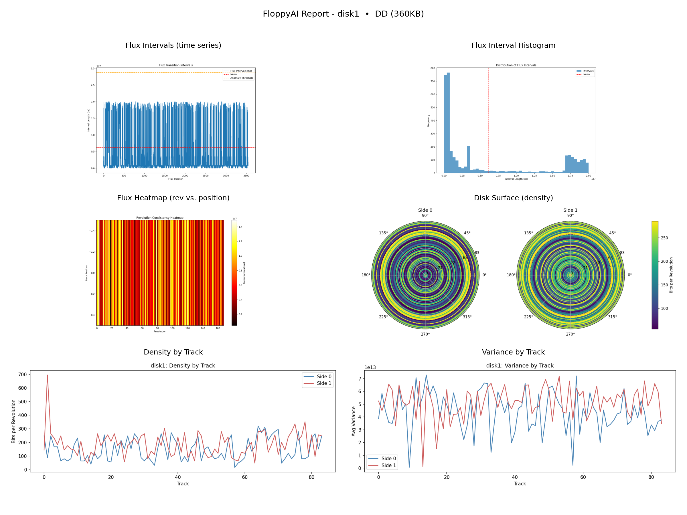

# FloppyAI

<p align="center">
  <a href="src/samples/disk1_composite_report.png">
    
  </a>
  <br/>
  <em>Sample per‑disk composite: flux plots, polar disk surface (both sides), density/variance by track</em>
 </p>

FloppyAI focuses on analyzing KryoFlux raw flux streams to understand the magnetic surface of floppy disks. There is no sector-level assumption; we work purely at the flux level to find strong/weak regions and plan better data layouts.

## Quick Start (Corpus-first)

1) Prepare your dumps
- Organize per-disk under a root folder, for example:
  - `stream_dumps/`
    - `diskA/kryoflux_stream/*.raw`
    - `diskB/kryoflux_stream/*.raw`
- Name the folders meaningfully; output labels derive from these names.

2) Run corpus analysis (from the repository root)
```bash
python -m FloppyAI.src.main analyze_corpus .\stream_dumps --generate-missing --rpm 360.0 --summarize \
  --lm-host 192.168.1.131:1234 --lm-model qwen-2.5-coder-finetuned --lm-temperature 0.0
```
- Tip: prefer the `python -m FloppyAI.src.main` form so the package resolves cleanly.
- `--generate-missing` processes each disk with `analyze_disk`.
- `--rpm 360.0` assumes a 1.2MB 5.25" drive.

3) Inspect outputs
- One image per disk: `test_outputs/<timestamp>/disks/<disk-label>/<disk-label>_composite.png` (now includes Instability Map panel)
- Standalone polar disk surface (both sides): `.../<disk-label>_disk_surface.png`
- High‑res side images: `.../<disk-label>_surface_side0.png`, `.../<disk-label>_surface_side1.png`
- Instability summary CSV: `.../<disk-label>_instability_summary.csv`
- Corpus surfaces montages: `corpus_surfaces_grid.png`, `corpus_side0_surfaces_grid.png`, `corpus_side1_surfaces_grid.png`
- Corpus summary and plots: `test_outputs/<timestamp>/corpus_*` and `corpus_summary.json`

4) Interpret the composite
- Flux intervals and histogram reveal timing distribution.
- Flux heatmap (rev vs position) shows surface consistency and weak regions.
- Polar map overlays Side 0/1 density per track with a clear colorbar.
- Density/Variance by track show radial trends.
- Title includes a simple HD/DD heuristic from mean cell interval.

5) Workflow (surface-first)
- Build baselines on new, unformatted floppies.
- Format, re-read, and compare to the baseline.
- Use the maps to plan where/what to write back (avoid noisy bands; pack stronger tracks).

## How to Run

- Recommended: run all commands from the repository root using module syntax
```
python -m FloppyAI.src.main --help
```
- Alternate: from `FloppyAI/src/` you can run `python main.py ...` but some subprocess flows assume module invocation from root.

### analyze_corpus
```
python -m FloppyAI.src.main analyze_corpus <root_or_map.json> [--generate-missing] [--rpm FLOAT] [--profile 35HD|35DD|525HD|525DD] [--summarize] \
  [--lm-host HOST:PORT] [--lm-model MODEL] [--lm-temperature 0.2] [--output-dir]
```
Outputs are placed under `test_outputs/<timestamp>/disks/<disk-label>/`. If you provide `--output-dir` to analyze_corpus, that directory is used instead of a timestamp.

Notes on RPM/Profile:
- `--rpm` accepts any float; if provided, it overrides `--profile`.
- `--profile` maps common drives to RPM: `35HD`/`35DD` → 300, `525HD` → 360, `525DD` → 300.
- `--generate-missing` will propagate the effective RPM to each `analyze_disk` call for consistent normalization.

### analyze_disk
```
python -m FloppyAI.src.main analyze_disk <path-to-dir-or-raw> [--rpm FLOAT] [--profile 35HD|35DD|525HD|525DD] [--summarize] [--lm-host HOST:PORT] \
  [--lm-model MODEL] [--lm-temperature 0.2] [--output-dir]
```
Saves `surface_map.json`, flux plots, the combined polar disk‑surface (`<label>_surface_disk_surface.png`), per‑side high‑res surfaces (`<label>_surface_side0.png`, `..._side1.png`), Instability Map (`<label>_instability_map.png`), Instability CSV (`<label>_instability_summary.csv`), and a composite image (`<label>_composite_report.png`).

### analyze (single .raw)
```
python -m FloppyAI.src.main analyze <input.raw> [--output-dir]
```
Generates per-file flux plots and stats.

## Installation

1. Python 3.8+ and `pip`.
2. `pip install -r requirements.txt`.
3. Hardware: KryoFlux connected; DTC.exe in `../lib/kryoflux_3.50_windows_r2/dtc/`.
4. Optional LLM: run LM Studio locally and pass `--lm-host` and `--lm-model`.

## Disk Surface Visualization

Polar map shows average bits‑per‑revolution per track (radius = track index). Both sides are in one figure with the colorbar to the right. Output naming uses input‑derived labels for clarity.

High‑fidelity rendering:
- Combined polar and Instability maps are saved at high DPI with increased angular resolution and radial upsampling for smooth imagery.
- Per‑side high‑res surfaces are provided to inspect each side independently while preserving a shared density scale.

Instability and Structure:
- For each track/side we compute `instability_score` (0‑1) and a simple `structure_score` (0‑1). These are saved into `surface_map.json` and summarized in `<label>_instability_summary.csv`.
- The composite prefers the Instability Map panel; if unavailable, it falls back to the revolution heatmap.

Single‑sided detection:
- We detect likely single‑sided disks either by very low Side‑1 coverage or by near‑duplicate Side‑1 vs Side‑0 density radials.
- When detected, the composite title includes “Single‑sided (S1 missing|duplicated)”, and `surface_map.json` records the reason and coverage metrics under `global.insights`.

### Format‑Aware Overlays (MFM & GCR)

FloppyAI can draw sector‑arc overlays on the polar surface maps and persist the detected boundaries to JSON.

- Enable overlays via:
  - `--format-overlay`
  - `--overlay-mode mfm|gcr|auto` (default `mfm`)
  - `--angular-bins N` (resolution; default 720)
  - `--gcr-candidates "12,10,8,9,11,13"` (only used by `gcr`/`auto`)

What the options mean:
- `--overlay-mode mfm` uses an FFT+autocorrelation method to estimate the dominant sector count per revolution and phase (typical IBM MFM counts: 8, 9, 15, 18).
- `--overlay-mode gcr` uses a boundary‑contrast search tailored for Apple GCR media (e.g., classic Macintosh 400K/800K). It tests a set of hypothesized sector counts and picks the one with the strongest gap contrast.
- `--overlay-mode auto` runs both detectors and chooses the higher‑confidence result.
- `--gcr-candidates` supplies the list of hypothesized sector counts (k values). For Apple GCR, good starters are `12,10,8,9,11,13`. The detector scores each k and selects the best one.

Choosing good GCR candidates:
- If you know the likely format, put the expected k first. For many classic Mac GCR tracks, 10 or 12 are common; include neighbors to be safe (e.g., `12,10,8,9,11,13`).
- If you don’t know, use a wider set (e.g., `6,7,8,9,10,11,12,13,14`), and optionally increase `--angular-bins` (e.g., 900) for finer phase resolution.
- For IBM MFM (PC) media, you can use `--overlay-mode mfm` and ignore GCR candidates.

Outputs written when overlays are enabled:
- Per‑disk images (in the selected `--output-dir` or timestamped run):
  - `<label>_surface_disk_surface_overlay.png` (both sides)
  - `<label>_surface_side0_overlay.png`, `<label>_surface_side1_overlay.png`
- Per‑disk JSON:
  - `surface_map.json` includes `global.insights.overlay.by_side["0"|"1"] = { sector_count, boundaries_deg[], confidence, method }`
  - Per‑track hints: `surface_map["<track>"].overlay["0"|"1"]`
  - `overlay_debug.json` contains only the overlay block for quick inspection.

Corpus behavior with overlays:
- `analyze_corpus` aggregates any `surface_map.json` it finds under the input root. Use `--generate-missing` to build per‑disk maps first (propagates overlay flags to those runs).
- A manifest `corpus_inputs.txt` is written under `run_dir/corpus/` listing exactly which maps were consumed. If none are found, `corpus_no_inputs.txt` explains the search root.

Examples:
```
# MFM (PC) overlay, prefer 18 sectors (3.5" HD)
python -m FloppyAI.src.main analyze_disk .\streams\pcdisk --media-type 35HD --format-overlay --overlay-mode mfm --angular-bins 720

# GCR (Mac) overlay with candidates for classic 400K/800K
python -m FloppyAI.src.main analyze_disk .\streams\macdisk --media-type 35DD --format-overlay --overlay-mode gcr --gcr-candidates "12,10,8,9,11,13" --angular-bins 900

# Corpus from raw streams, generating per‑disk maps with overlays then aggregating
python -m FloppyAI.src.main analyze_corpus .\stream_dumps --generate-missing --media-type 35DD --format-overlay --overlay-mode gcr --gcr-candidates "12,10,8,9,11,13"
```

#### Interpreting overlay visuals

- The overlay draws radial spokes at the detected sector boundary angles (`boundaries_deg`). Your eye sees the wedges between spokes as sector "slices".
- The number of spokes equals the detected `sector_count` (k). For example, k=10 yields lines every 36°.
- For MFM (IBM‑like) media, k is usually constant per side (e.g., 9, 15, 18) and the spokes are evenly spaced.
- For Mac GCR 400K/800K (CLV with zones), k can differ by radius (track). The per‑side overlay is a single aggregate; per‑track overlays recorded in `surface_map.json` show the zoned variation. If aggregate confidence is low, the tool falls back to the per‑track median k.
- Confidence reflects how much the boundary windows look like gaps (low transition density) compared to within‑sector windows. Low confidence suggests weak periodicity or heavy zoning across the tracks used.

#### Improving overlay visibility

- Use `--overlay-color` to change line color and `--overlay-alpha` to change opacity.
- Examples:
  - Bright red, 80% opacity:
    ```
    --overlay-color "#ff3333" --overlay-alpha 0.8
    ```
  - Bright yellow, 70% opacity:
    ```
    --overlay-color "#ffd60a" --overlay-alpha 0.7
    ```
- Increase `--angular-bins` (e.g., 900) for finer phase alignment if the lines look off.

#### Troubleshooting

- Empty or all‑around spokes at tiny increments usually mean a bad fallback. Re‑run with:
  - A sensible `--gcr-candidates` list for Mac GCR, e.g., `"12,11,10,9,8"`.
  - Moderate `--angular-bins` (720–1080).
  - If using `--overlay-mode auto` on Mac disks, pass `--media-type 35DD` to bias auto toward GCR.
- If per‑side detection remains weak on GCR, consult per‑track overlays in `surface_map.json`:
  - `"<track>".overlay["0"|"1"].sector_count` shows the zoned k per track.
  - The per‑side overlay will fall back to the median per‑track k when confidence is low.

## Notes

- Outputs respect `--output-dir` without adding timestamps. If omitted, `test_outputs/<timestamp>/` is used.
- We intentionally avoid sector/FS assumptions to focus on physical surface characteristics.
- The corpus overlays and per-disk labels prefer stream file names.

## Commands

1. **Analyze a Stream File** (Decode and visualize `.raw`):
   ```
   python -m FloppyAI.src.main analyze <input.raw> [--output-dir]
   ```
   - Parses flux transitions, computes stats (mean interval, noise variance).
   - Detects anomalies (short/long cells, weak bits via rev inconsistencies).
   - Generates plots: <input>_intervals.png (time series), <input>_hist.png (distribution), <input>_heatmap.png (if multi-rev).
   - Example: `python -m FloppyAI.src.main analyze ../../example_stream_data/unknown-stream00.0.raw`
     - Output: Stats like "Mean Interval: 4000.50 ns", "Short Cells: 5", visualizations saved.
   - For blanks: High variance indicates surface irregularities; low anomalies = clean media.

2. **Read Track from Hardware**:
   ```
   python -m FloppyAI.src.main read <track> <side> [--revs 3] [--simulate] [--analyze] [--output-dir]
   ```
   - Reads track/side (e.g., 0 0) to .raw using DTC.
   - --revs: Revolutions (default 3 for better analysis).
   - --simulate: Dry-run without hardware (no-op).
   - --analyze: Auto-analyze output .raw.
   - --rpm: Known RPM for normalization (default 360).
   - Use for blanks: Reveals baseline flux noise for custom encoding.

3. **Write Stream to Hardware**:
   ```
   python -m FloppyAI.src.main write <input.raw> <track> <side> [--simulate] [--output-dir]
   ```
   - Writes .raw to track/side.
   - --simulate: Dry-run (logs command).
   - Test custom flux on blanks to explore readability.

4. **Generate Dummy Stream** (Build custom flux for testing):
   ```
   python -m FloppyAI.src.main generate <track> <side> [--revs 1] [--cell 4000] [--analyze] [--output-dir]
   ```
   - Creates .raw with uniform intervals + noise (simulate one revolution).
   - --revs: Number of revolutions.
   - --cell: Nominal cell length ns (vary for density: shorter = higher density).
   - --analyze: Auto-analyze output.
   - --rpm: Known RPM for normalization (default 360).
   - Example: `python -m FloppyAI.src.main generate 0 0 dummy.raw --cell 2000 --analyze`
     - Generates denser flux; analyze to see interval distribution.

5. **Encode Binary Data to Custom Stream** (Prototype higher density encoding):
   ```
   python -m FloppyAI.src.main encode <input.bin> <track> <side> [--density 1.0] [--variable] [--revs 1] [--output <output.raw>] [--write] [--simulate] [--analyze] [--rpm 360] [--output-dir]
   ```
   - Encodes binary file to .raw using Manchester or variable RLL-like flux encoding.
   - --density: Scaling factor (>1.0 shortens cells for higher density; e.g., 2.0 for ~2x bits).
   - --variable: Use RLL-like variable cell lengths (short for 0s, long for 1s) for advanced packing.
   - --revs: Revolutions to fill (repeats data to embed continuously).
   - --output: Custom .raw path (default: encoded_track_X_Y.raw in timestamp dir).
   - --write: Auto-write .raw to hardware track/side after generation.
   - --simulate: Dry-run for --write (no hardware).
   - --analyze: Auto-analyze generated .raw (check density estimate vs. achieved).
   - --rpm: Known RPM for normalization (default 360).
   - Outputs achieved density (bits/rev) based on input size.
   - Example: `python -m FloppyAI.src.main encode test_data.bin 0 0 --density 2.0 --variable --rpm 360 --analyze`
     - Encodes 1KB data at 2x density with variable cells; prints ~8192 bits/rev (vs. standard ~4000); analyzes for noise/readability.
   - For density testing: Compare bits/rev in output to standard (analyze dummy at density=1.0); higher = success if low anomalies.

6. **Decode Custom Stream** (Recover binary data from encoded .raw):
   ```
   python -m FloppyAI.src.main decode <input.raw> [--density 1.0] [--variable] [--revs 1] [--output <output.bin>] [--expected <original.bin>] [--rpm 360] [--output-dir]
   ```
   - Decodes flux to binary using matching parameters.
   - --density: Expected density used in encoding.
   - --variable: Assume RLL-like variable cells.
   - --revs: Number of revolutions.
   - --output: Custom .bin path.
   - --expected: Original .bin for verification (reports % match, byte errors).
   - --rpm: Known RPM for normalization (default 360).
   - Example: `python -m FloppyAI.src.main decode test_encoded.raw --density 2.0 --variable --rpm 360 --expected test_data.bin`
     - Outputs test_decoded.bin; verifies 100% recovery for all-zero data (perfect for blanks).

7. **Analyze Disk Surface** (Batch process streams for full disk map):
   ```
   python -m FloppyAI.src.main analyze_disk [input] [--track N] [--side 0|1] [--rpm 360] [--output-dir] [--summarize]
   ```
   - input: Optional directory or single .raw file (default: ../example_stream_data/). Globs all *.raw if dir; auto-batches parent dir if single numbered file and siblings exist.
   - Parses track/side from filename ending in \d+\.\d+\.raw (e.g., Goofy00.0.raw → track 0 side 0); handles concatenated prefixes (e.g., blank180.1.raw → track 80 side 1).
   - Filters to tracks 0-83, sides 0-1; processes in order (00.0, 00.1, ..., 83.1), logging found vs expected (up to 168 files).
   - Use --track/--side for manual override if unparsable (applies to all files if no pattern).
   - --rpm: Known RPM for normalization/validation (default 360; scales partial reads to full rev, computes drift_pct ~0-5%, normalized densities).
   - Outputs surface_map.json: Per-track/side list of files with stats/analysis (normalized mean/std intervals, protection_score 0-1 from anomalies/variance, max_theoretical_density ~rev_time/min_int, is_protected >0.3); includes side summaries (avg_protection, likely_protected) and global (side_diff, packing_potential).
   - Generates combined PNG visualizations for entire disk (intervals, histogram, heatmap) and side_density_heatmap.png (bar charts of density per track/side, highlighting protection asymmetry).
   - --summarize: Auto-generates LLM-powered report. The tool now requests a strict JSON summary from the LLM and saves it to `llm_summary.json`, then renders the narrative to `llm_summary.txt`.
     - `--lm-temperature 0.2` recommended for accurate numeric reporting.
     - `--summary-format json|text` controls whether to write JSON plus text (json, default) or only text (text).
     - Works best with coder/instruct models like Qwen2-Coder Instruct.
   - Per-run outputs (in `--output-dir` if provided, otherwise under `test_outputs/<timestamp>/`):
     - `<label>_surface_disk_surface.png` (combined polar map for Side 0 and Side 1)
     - `<label>_density_by_track.png`, `<label>_variance_by_track.png`
     - `<label>_composite_report.png` (single composite image)
   - `<label>` is derived from the input stream filename or folder name.
   - Examples:
     - Default batch: `python -m FloppyAI.src.main analyze_disk` (processes example_stream_data/)
     - Full disk dir: `python -m FloppyAI.src.main analyze_disk .\stream_dumps\GoofyExpress\goofy_express\kryoflux_stream`
     - With normalization/summary: `python -m FloppyAI.src.main analyze_disk [path] --rpm 360 --summarize --lm-host localhost --lm-model llama3`

8. **Compare Reads** (Diff multiple reads of the same disk):
   ```
   python -m FloppyAI.src.main compare_reads <path_or_dir1> <path_or_dir2> [<...>] [--output-dir DIR]
   ```
   - Each item can be a surface_map.json or a directory containing one. Ensure you ran `analyze_disk` for each read first.
   - Outputs: `diff/diff_summary.json`, `diff/diff_densities.csv`
   - Example:
     - `python -m FloppyAI.src.main compare_reads .\test_outputs\win95_0 .\test_outputs\win95_1 --output-dir .\test_outputs\diff_win95`

9. **Classify Surface** (Blank-like vs written-like labels):
   ```
   python -m FloppyAI.src.main classify_surface <surface_map.json> [--blank-density-thresh 1000] [--output-dir DIR]
   ```
   - Writes `classification.json` with labels per track/side.

10. **Plan Pool** (Select top-quality tracks for a dense bit pool):
   ```
   python -m FloppyAI.src.main plan_pool <surface_map.json> [--min-density 2000] [--top-percent 0.2] [--output-dir DIR]
   ```
   - Writes `pool_plan.json` with selected tracks per side.
       - Outputs: JSON with protection on side 1 (score ~0.35, high variance/anomalies), heatmap showing ~500 bits/rev vs. 350 on side 0, summary like "Learned: Sparse fluxes for copy protection; pack more with density=1.8".
     - For protected disks: Detects schemes (e.g., weak bits via short_cells >40%, zoned in outer tracks).
   - Use for full disk: Maps surface, identifies coercivity/protection variations for adaptive encoding (e.g., higher density on clean zones).
   - Note: For single-file focus with per-file viz, use 'analyze'. Binary files like test_data.bin are for encode/decode, not flux analysis.

## Tips
- Use `--rpm 360` (or `--profile 525HD`) to normalize stats for 1.2MB 5.25" drives; use `--rpm 300` (or `--profile 35HD/35DD`) for 3.5".
- The composite title includes a simple HD/DD heuristic based on mean cell interval length.
- Run `analyze_disk` on blanks vs formatted to compare surfaces; use Instability Map and per‑side images to guide placement.
- LLM summaries use strict JSON schemas and deterministic fallbacks when no valid measurements are present.

## Next Steps
- Integrate AI EC (phase 3): Train models on surface map for error prediction, puzzle‑like patterns.
- LLM Enhancements: Customize prompts or integrate more models via LM Studio; tune per‑disk narrative schemas as needed.
- See [`docs/roadmap.md`](docs/roadmap.md) for the roadmap.

For issues, ensure running from src/ or use `python -m FloppyAI.src.main` from FloppyAI/.