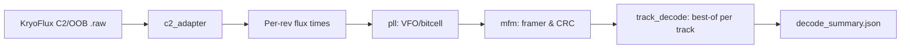

# Decoder Port Plan (Greaseweazle‑inspired)

This plan describes how we will re‑implement, in our own code, a compact flux‑to‑sectors decoder pipeline inspired by Greaseweazle, tailored for our KryoFlux C2/OOB streams and analysis workflow.

## Goals
- Provide optional, format‑aware decoding from raw flux to sectors for verification and experiments.
- Start with IBM MFM (PC 3.5"/5.25"), expand later to FM and Apple GCR.
- Keep decoding separate and optional; our primary focus remains flux‑first analysis.
- Produce small, useful artifacts (JSON summaries, light visuals) without per‑track PNG spam.

## Non‑Goals (for now)
- Full filesystem extraction or preservation imaging beyond sector maps.
- Cross‑machine orchestration changes (Linux DTC workflow remains as‑is).
- Copying or vendoring Greaseweazle code: we re‑implement the necessary logic.

## Inputs & Outputs
- Input: Our KryoFlux C2/OOB `.raw` files (`trackNN.S.raw`) with multiple revolutions.
- Outputs:
  - `decode_summary.json` per track: sectors (CHRN), CRC status, data size, best‑rev selection, PLL/jitter stats.
  - Optional lightweight visual marker PNG per track (sync/IDAM/DAM positions), disabled by default.
  - Integration hooks to append decode metrics into corpus/analysis summaries.

## Status Update — STREAM Write (2025‑09‑22)

- HxC reads our generated STREAM files and shows rough flux for Side 0; Side 1 appears sparse/garbled depending on the pattern.
- DTC refuses to open the generated files for writing, reporting:
  - `Image name:` / `Can't open image file:`
- We strictly used STREAM mode and CLI ordering (`-f<prefix>` first, then `-i0 -d -s -e -g -w`) and tried multiple base variants (`-ftrack`, `-ftrack.raw`, absolute `-f$(pwd)/track`, `-f$(pwd)/track.raw`). None were accepted by DTC on the test host.

Planned actions for alignment (tomorrow):
- Gather known‑good reference STREAMs via DTC capture for a few tracks/sides (e.g., 00.0, 00.1).
- Implement `kfx_probe.py` to dump OOB blocks (type/len/offsets) and opcode histograms; compare reference vs generated.
- Ensure OOB type 2 (Disk Index) includes a 16‑bit LE timer payload; verify initial index presence and header mode expectations (ASCII preamble vs OOB‑first).
- Adjust `src/stream_export.py` to mirror the reference files byte‑for‑byte per rev 1.1 and empirical DTC behavior.

See also:
- `docs/kryoflux_stream_notes.md` — concise summary of the STREAM protocol rev 1.1 we are following.
- `docs/stream_write_investigation.md` — commands tried, variants matrix, and findings log.

## Module Layout (new)

```text
FloppyAI/src/decoding/
  c2_adapter.py    # Convert C2/OOB -> per-rev flux transition times (+index boundaries)
  pll.py           # VFO/PLL for bitcell recovery (phase/period tracking, jitter stats)
  mfm.py           # MFM framer: sync detect (A1), IDAM & DAM parse, CRC16-IBM
  fm.py            # (Phase 3) FM decoder
  gcr.py           # (Phase 3) Apple GCR (400K/800K), zoned RPM awareness
  track_decode.py  # Orchestrate per-rev decode; choose best rev per sector; summarize

FloppyAI/tools/
  flux2sectors.py  # CLI: .raw -> decode_summary.json (and optional markers)
```

## Data Flow



## Algorithm Highlights
- **C2 Adapter (`c2_adapter.py`)**
  - Reuse our existing C2/OOB parsing (from `FluxAnalyzer.parse`) to extract transitions and index events.
  - Convert ticks to seconds with `sck_hz`; preserve per‑rev segmentation.

- **PLL/VFO (`pll.py`)**
  - Nominal bitcell from profile/RPM (e.g., ~4 µs MFM @ 300 RPM zones).
  - For each transition: compute phase error; gently update period (alpha/beta). Jitter stats (RMS) per rev.
  - Emit a clocked stream (clock/data) suitable for MFM framing.

- **MFM Framer (`mfm.py`)**
  - Detect sync (A1 with missing clock bit) sequences to align.
  - Parse IDAM (FE) → CHRN, size; DAM/DE/FB → data and CRC16‑IBM checks.
  - Robust re‑sync after noise; tolerate weak bits between frames.

- **Track Assembly (`track_decode.py`)**
  - Decode each revolution independently; pick best rev per sector (CRC‑OK first; else best score).
  - Summarize coverage, per‑rev success ratio, jitter/lock stats.

## CLI & Integrations
- **`tools/flux2sectors.py`**
  - `--input track00.0.raw` → `decode_summary.json` (and optional markers).
  - Options: `--format mfm` (default), `--rpm`, `--profile`, `--rev-limit`.
- **`tools/analyze_captures.py --decode-mfm` (Phase 2)**
  - Append per‑file decode metrics (sectors_ok/total, jitter_rms_ns, best_rev_ok_ratio).
- **`tools/compare_corpus.py` (Phase 2)**
  - Include jitter deltas and “best rev” changes across passes for stability analysis.

## Phases & Deliverables
- **Phase 1 (MFM MVP)**
  - Implement: `c2_adapter.py`, minimal `pll.py`, `mfm.py`, `track_decode.py`, `tools/flux2sectors.py`.
  - Validate on known MFM captures; confirm plausible sector maps and CRC‑OK counts.
- **Phase 2 (Integration)**
  - Add `--decode-mfm` to `analyze_captures.py` and corpus comparison metrics (jitter, best rev).
- **Phase 3 (Formats)**
  - Add FM decoder; add Apple GCR decoder with zoned RPM awareness.
  - Optional: simple IMG writer for PC MFM (flat sector order) for quick mount tests.

## Testing Strategy
- Unit‑level tests for PLL (phase/jitter), MFM CRC, sync detection.
- Golden‑file tests: small known MFM track(s), verify sector map.
- End‑to‑end smoke: `.raw -> flux2sectors.py -> decode_summary.json`, inspect counts and CRC.

## Success Criteria
- Phase 1: For clean MFM tracks, majority of sectors decode with CRC‑OK in at least one rev.
- Phase 2: Decode metrics appear in analysis summaries and correlate with stability findings.
- Phase 3: FM and GCR paths operational on representative media.

## Risks & Mitigations
- **RPM/bitcell mismatch**: Use profile defaults; allow CLI overrides; add auto‑hint from index timing.
- **Weak media**: Best‑rev selection masks some issues; still report jitter/lock stats.
- **Performance**: Offer `--rev-limit` and skip visuals by default; vectorize hot loops as needed.

## Licensing Note
We implement our own decoder logic, informed by public knowledge and experimentation. We do not copy or vendor Greaseweazle code; any similarities are conceptual. This keeps our core licensing unconstrained while enabling experiments.

## Next Steps
1. Implement Phase 1 modules and `tools/flux2sectors.py`.
2. Validate on a known MFM dataset.
3. Integrate optional decode into `analyze_captures.py` and `compare_corpus.py`.
